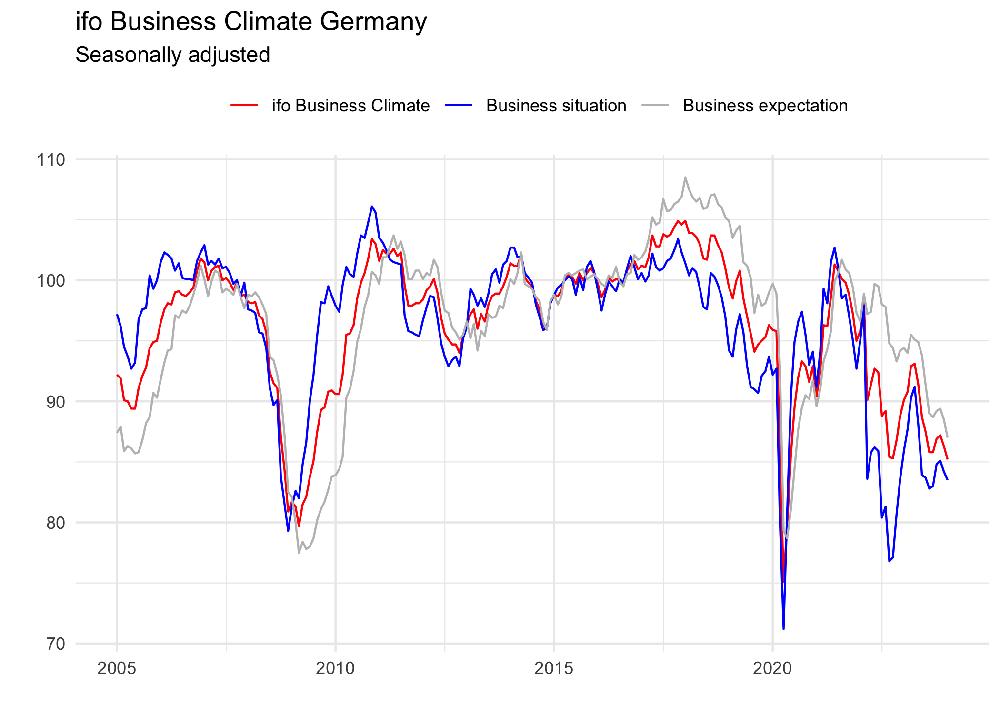

<!-- README.md is generated from README.Rmd. Please edit that file -->

# ifo

<!-- badges: start -->

[](https://lifecycle.r-lib.org/articles/stages.html#experimental)
[](https://github.com/m-muecke/ifo/actions/workflows/R-CMD-check.yaml)
<!-- badges: end -->

## Overview

The goal of ifo is to provide a simple interface to the [ifo
institute](https://www.ifo.de/en/ifo-time-series) business survey data.
The shape of the output data is still experimental and might change in
the future. Feel free to open an issue if you have any suggestions.

## Installation

You can install the development version of ifo from
[GitHub](https://github.com/) with:

``` r
# install.packages("pak")
pak::pak("m-muecke/ifo")
```

## Usage

``` r
library(ifo)

climate <- ifo_climate()
climate
#> # A tibble: 229 × 9
#>    yearmonth  climate_index situation_index expectation_index climate_balance
#>    <date>             <dbl>           <dbl>             <dbl>           <dbl>
#>  1 2005-01-01          92.2            87.4              97.2             1.5
#>  2 2005-02-01          91.9            87.9              96.2             0.9
#>  3 2005-03-01          90.1            85.9              94.5            -3.1
#>  4 2005-04-01          90              86.3              93.7            -3.4
#>  5 2005-05-01          89.4            86.1              92.7            -4.7
#>  6 2005-06-01          89.4            85.7              93.2            -4.6
#>  7 2005-07-01          91.1            85.8              96.8            -0.8
#>  8 2005-08-01          92.1            86.8              97.6             1.2
#>  9 2005-09-01          92.8            88.2              97.7             2.9
#> 10 2005-10-01          94.4            88.7             100.              6.3
#> # ℹ 219 more rows
#> # ℹ 4 more variables: situation_balance <dbl>, expectation_balance <dbl>,
#> #   uncertainty <dbl>, economic_expansion <dbl>

library(dplyr)
library(ggplot2)

climate |>
  select(yearmonth, ends_with("index")) |>
  tidyr::pivot_longer(-yearmonth, names_to = "component", values_to = "value") |>
  mutate(component = sub("_index", "", component)) |>
  ggplot(aes(x = yearmonth, y = value, color = component)) +
  geom_line() +
  labs(title = "ifo Business Climate Germany", subtitle = "Seasonally adjusted", y = "", x = "") +
  theme_minimal() +
  theme(legend.title = element_blank(), legend.position = "top") +
  scale_color_manual(
    values = c("climate" = "red", "situation" = "grey", "expectation" = "blue"),
    labels = c("ifo Business Climate", "Business Situation", "Business Expectation")
  )
```


