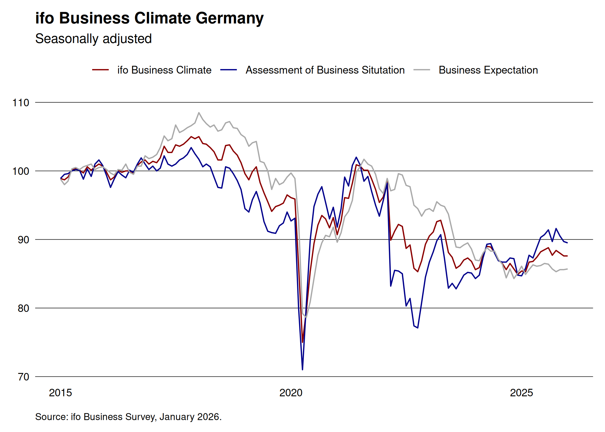

<!-- README.md is generated from README.Rmd. Please edit that file -->

# ifo

<!-- badges: start -->

[](https://lifecycle.r-lib.org/articles/stages.html#experimental)
[](https://github.com/m-muecke/ifo/actions/workflows/R-CMD-check.yaml)
[](https://CRAN.R-project.org/package=ifo)
<!-- badges: end -->

## Overview

The goal of ifo is to provide a simple interface to the [ifo
institute](https://www.ifo.de/en/ifo-time-series) time series data. The
package is still in an early stage of development and the API might
change in the future. Feel free to open an issue if you have any
suggestions.

## Installation

You can install the released version of ifo from
[CRAN](https://CRAN.R-project.org) with:

``` r
install.packages("ifo")
```

And the development version from [GitHub](https://github.com/) with:

``` r
# install.packages("pak")
pak::pak("m-muecke/ifo")
```

## Usage

``` r
library(ifo)

climate <- ifo_business()
head(climate)
#>    yearmonth uncertainty economic_expansion indicator series value
#> 1 2005-01-01          NA               83.1   climate  index  92.2
#> 2 2005-02-01          NA               50.4   climate  index  92.0
#> 3 2005-03-01          NA                4.9   climate  index  90.1
#> 4 2005-04-01          NA               18.7   climate  index  89.9
#> 5 2005-05-01          NA               11.7   climate  index  89.3
#> 6 2005-06-01          NA               32.1   climate  index  89.3
```


