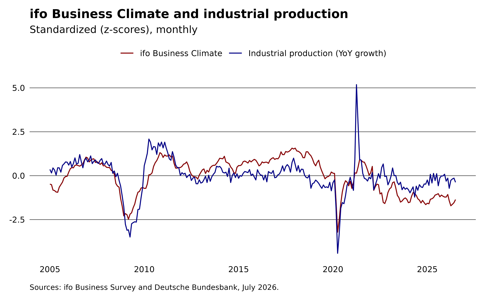
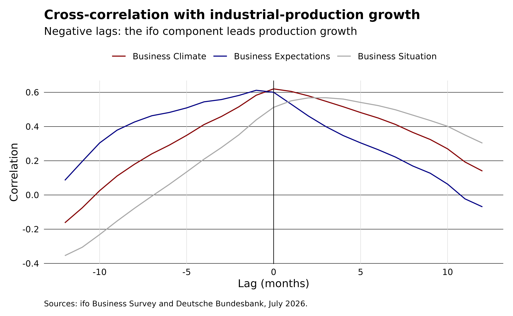
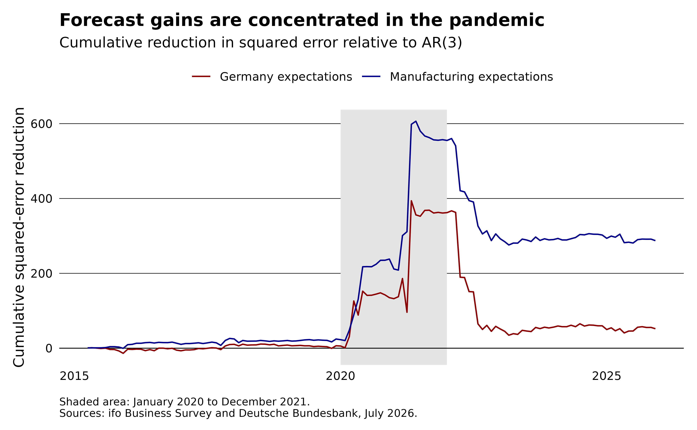

# Evaluating the ifo Business Climate as a leading indicator

Firms report their current situation and expectations before official
statistics become available, so the ifo Business Climate may reveal
changes in economic activity earlier. We test this claim by adapting the
evaluation framework of [Hüfner and Schröder
(2002)](https://ftp.zew.de/pub/zew-docs/dp/dp0256.pdf). This article
revisits the main qualitative tests with current data rather than
reproducing the original samples or forecast tables. [Lehmann
(2023)](https://link.springer.com/article/10.1007/s41549-022-00079-5)
provides a broader review of the forecasting evidence from the ifo
Business Survey.

Following [Fritsche and Stephan
(2000)](https://www.diw.de/documents/publikationen/73/diw_01.c.38582.de/dp207.pdf),
we ask whether the ifo index satisfies three criteria of a good leading
indicator:

1.  **Co-movement.** The indicator should move with industrial
    production.
2.  **Predictive content.** The relationship should be statistically
    significant and stable over time, and the indicator should improve
    on a simple autoregressive model of activity.
3.  **Forecast value.** Including the indicator should improve
    out-of-sample forecasts relative to a naive benchmark.

We use the ifo Business Climate together with the German industrial
production index. Both series are monthly, so no mixed-frequency
modeling is needed. We download industrial production from the Deutsche
Bundesbank with the [bbk](https://m-muecke.github.io/bbk/) package.

``` r

library(ifo)
library(bbk)
library(data.table)
library(ggplot2)

theme_ifo <- function(...) {
  theme_minimal(...) +
    theme(
      legend.title = element_blank(),
      legend.position = "top",
      plot.title = element_text(face = "bold"),
      plot.caption = element_text(hjust = 0, vjust = 0, size = 8, margin = margin(10, 0, 0, 0)),
      panel.grid.major.y = element_line(color = "black", linewidth = 0.2),
      panel.grid.major.x = element_blank(),
      panel.grid.minor = element_blank(),
      axis.text = element_text(color = "black"),
      axis.title = element_blank(),
      plot.margin = margin(10, 10, 10, 10)
    )
}
```

### Assembling the data

The ifo Business Climate for Germany comes in long format. We keep the
headline *index* values and reshape climate, situation, and expectations
into columns.

``` r

survey_long <- setDT(ifo_business("germany"))
survey <- dcast(survey_long[series == "index"], yearmonth ~ indicator, value.var = "value")
head(survey)
#> Key: <yearmonth>
#>     yearmonth climate expectation situation
#>        <Date>   <num>       <num>     <num>
#> 1: 2005-01-01    92.2        97.2      87.5
#> 2: 2005-02-01    92.0        96.2      87.9
#> 3: 2005-03-01    90.1        94.5      85.8
#> 4: 2005-04-01    89.9        93.7      86.3
#> 5: 2005-05-01    89.4        92.7      86.1
#> 6: 2005-06-01    89.3        93.2      85.6
```

German industrial production (producing sector excluding construction,
calendar and seasonally adjusted, 2021 = 100) is a single Bundesbank
series. We convert the level index into a **year-on-year growth rate**,
the transformation used by Hüfner and Schröder as their measure of
economic activity.

``` r

ip <- bbk_data("BBDE1", key = "M.DE.Y.BAA1.A2P100000.G.C.I21.A") |>
  setorder(date) |>
  _[, .(yearmonth = date, ip_growth = 100 * (value / shift(value, 12L) - 1))]

activity <- survey[ip, on = "yearmonth", nomatch = 0L]
```

The production series reaches back to 1991, but the ifo index for
Germany as a whole starts in January 2005, so the overlapping sample
runs from January 2005 to July 2026 (259 months).

### Criterion 1: co-movement

Plotting the ifo climate index against industrial-production growth
shows how closely the two series track each other (both standardized to
make them comparable on one axis).

``` r

z <- function(x) (x - mean(x)) / sd(x)
activity[, .(yearmonth, ifo = z(climate), ip = z(ip_growth))] |>
  melt(id.vars = "yearmonth") |>
  ggplot(aes(x = yearmonth, y = value, color = variable)) +
  geom_line() +
  labs(
    title = "ifo Business Climate and industrial production",
    subtitle = "Standardized (z-scores), monthly",
    caption = sprintf(
      "Sources: ifo Business Survey and Deutsche Bundesbank, %s.",
      format(max(activity$yearmonth), "%B %Y")
    )
  ) +
  scale_color_manual(
    values = c(ifo = "darkred", ip = "darkblue"),
    labels = c(ifo = "ifo Business Climate", ip = "Industrial production (YoY growth)")
  ) +
  theme_ifo()
```



The two follow the same broad swings, though they drift apart at times,
and the contemporaneous correlation is moderate rather than tight:

``` r

cor(activity$climate, activity$ip_growth)
#> [1] 0.6199274
```

To examine the lead-lag structure, we use the cross-correlation
function. Negative lags describe the ifo index *leading* production
growth. We separate the headline climate index into the assessment of
the **current situation** and the forward-looking **expectations**.
Hüfner and Schröder stress the expectations component, since a leading
signal should come from what firms anticipate rather than from what they
already observe.

``` r

xc <- activity |>
  melt(
    id.vars = "ip_growth",
    measure.vars = c("situation", "expectation", "climate"),
    variable.name = "component",
    value.name = "ifo_value",
    variable.factor = FALSE
  ) |>
  _[,
    {
      cc <- ccf(ifo_value, ip_growth, lag.max = 12L, plot = FALSE)
      .(lag = as.integer(cc$lag), correlation = as.numeric(cc$acf))
    },
    by = component
  ]

ggplot(xc, aes(x = lag, y = correlation, color = component)) +
  geom_line() +
  geom_vline(xintercept = 0, linewidth = 0.3) +
  labs(
    title = "Cross-correlation with industrial-production growth",
    subtitle = "Negative lags: the ifo component leads production growth",
    x = "Lag (months)",
    y = "Correlation",
    caption = sprintf(
      "Sources: ifo Business Survey and Deutsche Bundesbank, %s.",
      format(max(activity$yearmonth), "%B %Y")
    )
  ) +
  scale_color_manual(
    values = c(climate = "darkred", expectation = "darkblue", situation = "darkgrey"),
    labels = c(
      climate = "Business Climate",
      expectation = "Business Expectations",
      situation = "Business Situation"
    )
  ) +
  theme_ifo() +
  theme(
    axis.title = element_text(),
    panel.grid.major.x = element_line(color = "grey85", linewidth = 0.2)
  )
```



The lag at which each curve peaks orders the three components as the
theory suggests:

``` r

xc[, .SD[which.max(correlation)], by = component]
#>      component   lag correlation
#>         <char> <int>       <num>
#> 1:   situation     3   0.5681060
#> 2: expectation    -1   0.6123049
#> 3:     climate     0   0.6199274
```

The peak correlation occurs at lag -1 for expectations, 0 for the
climate index, and 3 for the situation assessment. Because negative lags
indicate a lead over production, only expectations peak ahead of
production, and the lead is short: the correlation is nearly flat
between lag -1 and lag 0. A formal test can determine whether this lead
holds after accounting for the history of production itself.

### Criterion 2: Granger causality

A leading indicator should carry information about the *future* of the
reference series. The [Granger
causality](https://en.wikipedia.org/wiki/Granger_causality) test asks
whether past values of the ifo index improve a forecast of production
growth beyond production growth’s own past. We also test the reverse
direction: an indicator that merely reacts to production would be
predicted by it. This tests predictive information, not an economic
causal mechanism.

``` r

pval <- function(x) format(signif(x[["Pr(>F)"]][2L], 2L), scientific = FALSE)

forward <- lmtest::grangertest(ip_growth ~ climate, order = 3L, data = activity)
reverse <- lmtest::grangertest(climate ~ ip_growth, order = 3L, data = activity)
forward
#> Granger causality test
#> 
#> Model 1: ip_growth ~ Lags(ip_growth, 1:3) + Lags(climate, 1:3)
#> Model 2: ip_growth ~ Lags(ip_growth, 1:3)
#>   Res.Df Df      F    Pr(>F)    
#> 1    249                        
#> 2    252 -3 7.3804 9.324e-05 ***
#> ---
#> Signif. codes:  0 '***' 0.001 '**' 0.01 '*' 0.05 '.' 0.1 ' ' 1
reverse
#> Granger causality test
#> 
#> Model 1: climate ~ Lags(climate, 1:3) + Lags(ip_growth, 1:3)
#> Model 2: climate ~ Lags(climate, 1:3)
#>   Res.Df Df      F Pr(>F)
#> 1    249                 
#> 2    252 -3 0.3328 0.8016
```

The predictive relationship is one-directional. Lags of the ifo climate
improve the production model (p = 0.000093), while lags of production do
not improve the climate model (p = 0.8).

Consistent with the cross-correlation, the forward-looking expectations
component gives a slightly stronger signal than the headline climate
index.

``` r

lmtest::grangertest(ip_growth ~ expectation, order = 3L, data = activity)
#> Granger causality test
#> 
#> Model 1: ip_growth ~ Lags(ip_growth, 1:3) + Lags(expectation, 1:3)
#> Model 2: ip_growth ~ Lags(ip_growth, 1:3)
#>   Res.Df Df      F    Pr(>F)    
#> 1    249                        
#> 2    252 -3 8.3522 2.593e-05 ***
#> ---
#> Signif. codes:  0 '***' 0.001 '**' 0.01 '*' 0.05 '.' 0.1 ' ' 1
```

### Criterion 2: in-sample fit

The second criterion also asks the indicator to improve on a simple
autoregressive model of activity. Does the ifo index add anything beyond
what production growth already says about itself? We compare an
autoregressive benchmark that predicts production growth from its own
three lags against the same model augmented with three lags of the ifo
climate index (the specification underlying the Granger test above). The
comparison is in-sample: it measures fit, not out-of-sample forecast
accuracy.

``` r

dt <- activity |>
  _[, .(
    ip_growth,
    g1 = shift(ip_growth, 1L),
    g2 = shift(ip_growth, 2L),
    g3 = shift(ip_growth, 3L),
    c1 = shift(climate, 1L),
    c2 = shift(climate, 2L),
    c3 = shift(climate, 3L)
  )] |>
  na.omit()

fit_ar <- lm(ip_growth ~ g1 + g2 + g3, data = dt)
fit_ar_ifo <- lm(ip_growth ~ g1 + g2 + g3 + c1 + c2 + c3, data = dt)

rmse <- function(x) sqrt(mean(residuals(x)^2))
data.table(
  model = c("AR(3)", "AR(3) + ifo"),
  adj_r2 = c(summary(fit_ar)$adj.r.squared, summary(fit_ar_ifo)$adj.r.squared),
  rmse_in_sample = c(rmse(fit_ar), rmse(fit_ar_ifo))
)
#>          model    adj_r2 rmse_in_sample
#>         <char>     <num>          <num>
#> 1:       AR(3) 0.7486296       3.443976
#> 2: AR(3) + ifo 0.7663751       3.300365
```

Adding the climate index raises adjusted R² from 0.749 to 0.766 and
lowers in-sample RMSE from 3.44 to 3.30. The nested-model F test rejects
the three climate coefficients being jointly zero (p = 0.000093). This
is the same test used in the forward Granger comparison above:

``` r

anova(fit_ar, fit_ar_ifo)
#> Analysis of Variance Table
#> 
#> Model 1: ip_growth ~ g1 + g2 + g3
#> Model 2: ip_growth ~ g1 + g2 + g3 + c1 + c2 + c3
#>   Res.Df    RSS Df Sum of Sq      F    Pr(>F)    
#> 1    252 3036.4                                  
#> 2    249 2788.5  3    247.95 7.3804 9.324e-05 ***
#> ---
#> Signif. codes:  0 '***' 0.001 '**' 0.01 '*' 0.05 '.' 0.1 ' ' 1
```

### Criterion 3: forecast value

In-sample fit does not guarantee a better forecast, so the third
criterion asks whether the indicator improves out-of-sample forecasts.
We switch from the index values used above to the balances: the vintage
workbooks provide balances only, and Hüfner and Schröder also work with
the expectations balance. We compare the Germany-wide climate,
situation, and expectations balances in an expanding-window design. We
also include manufacturing expectations to test whether a more closely
matched survey series improves the forecast, as suggested by Lehmann’s
review. For manufacturing expectations, we use the value first published
for each month. This prevents later survey revisions from entering
earlier forecasts. Starting with ten years of data, we re-estimate each
model monthly and predict the next observation.

``` r

germany_components <- survey_long |>
  _[series == "balance"] |>
  dcast(yearmonth ~ indicator, value.var = "value") |>
  setnames(
    c("climate", "situation", "expectation"),
    c("de_climate", "de_situation", "de_expectation")
  )
manufacturing_expectation <- setDT(ifo_vintage("manufacturing"))[
  vintage == yearmonth & series == "balance" & indicator == "expectation",
  .(yearmonth, mfg_expectation = value)
]
forecast_data <- mergelist(
  list(
    activity[, .(yearmonth, ip_growth)],
    germany_components,
    manufacturing_expectation
  ),
  on = "yearmonth",
  how = "inner"
)

lag_variables <- setdiff(names(forecast_data), "yearmonth")
lags <- 1:3
lag_columns <- paste0(rep(lag_variables, each = length(lags)), lags)
forecast_data[, (lag_columns) := shift(.SD, lags), .SDcols = lag_variables]

models <- list(
  "AR(3)" = paste0("ip_growth", lags),
  "Germany climate" = c(paste0("ip_growth", lags), paste0("de_climate", lags)),
  "Germany situation" = c(paste0("ip_growth", lags), paste0("de_situation", lags)),
  "Germany expectations" = c(paste0("ip_growth", lags), paste0("de_expectation", lags)),
  "Manufacturing expectations" = c(paste0("ip_growth", lags), paste0("mfg_expectation", lags))
)

required <- c("ip_growth", unique(unlist(models)))
forecast_data <- na.omit(forecast_data, cols = required)
initial_window <- 120L
forecast_months <- initial_window + seq_len(nrow(forecast_data) - initial_window)

roll_forecast <- function(predictors, model) {
  formula <- reformulate(predictors, response = "ip_growth")
  predicted <- vapply(
    forecast_months,
    function(month) {
      fit <- lm(formula, data = forecast_data[seq_len(month - 1L)])
      predict(fit, newdata = forecast_data[month])
    },
    numeric(1L)
  )
  data.table(
    model,
    yearmonth = forecast_data$yearmonth[forecast_months],
    actual = forecast_data$ip_growth[forecast_months],
    predicted
  )
}

predictions <- rbindlist(Map(roll_forecast, predictors = models, model = names(models)))

forecast_scores <- predictions |>
  _[, .(months = .N, rmse = sqrt(mean((actual - predicted)^2))), by = model] |>
  _[, improvement_over_ar := 100 * (rmse[model == "AR(3)"] - rmse) / rmse[model == "AR(3)"]] |>
  _[, let(rmse = round(rmse, 2L), improvement_over_ar = round(improvement_over_ar, 1L))]
forecast_scores[]
#>                         model months  rmse improvement_over_ar
#>                        <char>  <int> <num>               <num>
#> 1:                      AR(3)    129  4.61                 0.0
#> 2:            Germany climate    129  4.58                 0.7
#> 3:          Germany situation    129  4.63                -0.5
#> 4:       Germany expectations    129  4.57                 1.0
#> 5: Manufacturing expectations    129  4.36                 5.4
```

Across 129 forecasts, Germany-wide expectations lower RMSE by 1%
relative to the AR benchmark, slightly more than the climate balance at
0.7%. The situation balance raises RMSE by 0.5%. Manufacturing
expectations lower it by 5.4%. The forecast ranking therefore agrees
with the lead-lag analysis, although the differences between the
Germany-wide components are small. The closer sectoral match appears to
matter, but industrial production is broader than manufacturing alone.
This remains a pseudo-out-of-sample exercise because industrial
production and the Germany-wide balances use their latest vintages. The
manufacturing series uses first-release values.

Are these gains statistically distinguishable from the benchmark? A
[Diebold and Mariano
(1995)](https://doi.org/10.1080/07350015.1995.10524599) test on the
squared-error differentials would be conservative here because the
models are nested: each survey model contains the AR(3) benchmark, so
its extra coefficients add estimation noise to its forecasts. [Clark and
West (2007)](https://doi.org/10.1016/j.jeconom.2006.05.023) correct for
this by adding the squared difference between the two forecasts back to
the loss differential. The adjusted statistic is approximately standard
normal, and the test is one-sided: does the survey model improve on the
benchmark?

``` r

cw_scores <- predictions |>
  _[, .(yearmonth, model, actual, predicted)] |>
  _[, benchmark := predicted[model == "AR(3)"], by = yearmonth] |>
  _[
    model != "AR(3)",
    {
      f <- (actual - benchmark)^2 - (actual - predicted)^2 + (benchmark - predicted)^2
      cw <- mean(f) / sqrt(var(f) / .N)
      .(cw_statistic = cw, p_value = pnorm(-cw))
    },
    by = model
  ]
cw_scores[, .(
  model,
  cw_statistic = round(cw_statistic, 2L),
  p_value = round(p_value, 2L)
)]
#>                         model cw_statistic p_value
#>                        <char>        <num>   <num>
#> 1:            Germany climate         1.00    0.16
#> 2:          Germany situation         0.62    0.27
#> 3:       Germany expectations         1.28    0.10
#> 4: Manufacturing expectations         1.97    0.02
```

Only manufacturing expectations clear the 5% level (p = 0.02).
Germany-wide expectations are borderline (p = 0.10), and the climate and
situation balances are clearly insignificant. The evidence for added
predictive content is therefore concentrated in the survey series that
matches the reference variable most closely. Whether that evidence rests
on a few extreme months is the next question.

### When do the survey indicators help?

The second criterion also requires the relationship to be stable over
time, and the average RMSE hides when the forecast gains occur. We
accumulate the monthly difference in squared errors between the AR
benchmark and each model with expectations. The line rises when the
survey model produces the smaller error and falls when the benchmark
does.

``` r

forecast_gain <- predictions |>
  _[, .(yearmonth, model, error = (actual - predicted)^2)] |>
  _[, benchmark_error := error[model == "AR(3)"], by = yearmonth] |>
  _[model %in% c("Germany expectations", "Manufacturing expectations")] |>
  setorder(model, yearmonth) |>
  _[, .(yearmonth, cumulative_gain = cumsum(benchmark_error - error)), by = model]

ggplot(forecast_gain, aes(x = yearmonth, y = cumulative_gain, color = model)) +
  annotate(
    "rect",
    xmin = as.Date("2020-01-01"),
    xmax = as.Date("2021-12-31"),
    ymin = -Inf,
    ymax = Inf,
    fill = "grey90",
    color = NA
  ) +
  geom_hline(yintercept = 0, linewidth = 0.3) +
  geom_line() +
  labs(
    title = "Forecast gains are concentrated in the pandemic",
    subtitle = "Cumulative reduction in squared error relative to AR(3)",
    y = "Cumulative squared-error reduction",
    caption = sprintf(
      "Shaded area: January 2020 to December 2021.\nSources: ifo Business Survey and Deutsche Bundesbank, %s.",
      format(max(activity$yearmonth), "%B %Y")
    )
  ) +
  scale_color_manual(
    values = c("Germany expectations" = "darkred", "Manufacturing expectations" = "darkblue")
  ) +
  theme_ifo() +
  theme(axis.title.y = element_text())
```



### Caveats

**The pandemic has an outsized influence on the sample.** Most of the
cumulative forecast gain appears in 2020 and 2021. After 2022,
Germany-wide expectations give back most of that advantage and
manufacturing expectations about half of it. The full-sample RMSE
therefore does not show a stable forecasting advantage. A pre-2020
estimation or pandemic indicators would provide a stricter sensitivity
check.

**Industrial production and the Germany-wide ifo series use their latest
vintages.** Manufacturing expectations use first-release values. The ifo
survey appears during its reference month, while official production
figures appear several weeks later and are revised. A fully real-time
nowcast would need release-date-aligned production vintages and could
not use unpublished production lags. See [Lehmann and Reif
(2021)](https://link.springer.com/article/10.1007/s41549-021-00055-5)
for a real-time comparison. This exercise demonstrates how to assess a
leading indicator. It does not settle the ifo survey’s forecasting
record.
