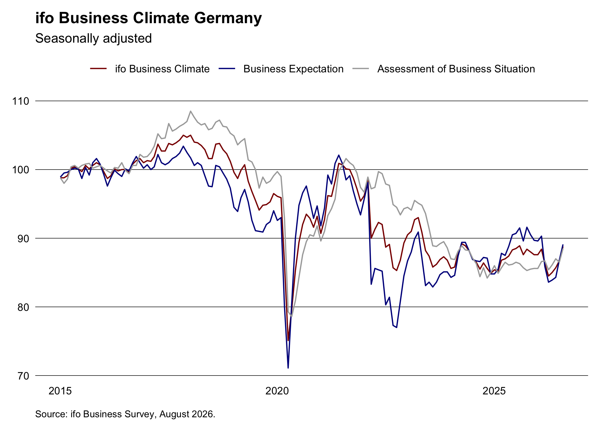

# ifo

## Overview

The goal of ifo is to provide a simple interface to the [ifo
institute](https://www.ifo.de/en/ifo-time-series) time series data. Feel
free to open an issue if you have any suggestions.

## Installation

You can install the released version of ifo from
[CRAN](https://CRAN.R-project.org) with:

``` r

install.packages("ifo")
```

And the development version from [GitHub](https://github.com/) with:

``` r

# install.packages("pak")
pak::pak("m-muecke/ifo")
```

## Usage

``` r

library(ifo)

climate <- ifo_business()
head(climate)
#>    yearmonth uncertainty economic_expansion   indicator  series value
#> 1 2005-01-01          NA               83.1     climate   index  92.2
#> 2 2005-01-01          NA               83.1   situation   index  87.5
#> 3 2005-01-01          NA               83.1 expectation   index  97.2
#> 4 2005-01-01          NA               83.1     climate balance   1.5
#> 5 2005-01-01          NA               83.1   situation balance  -0.7
#> 6 2005-01-01          NA               83.1 expectation balance   3.8
```


